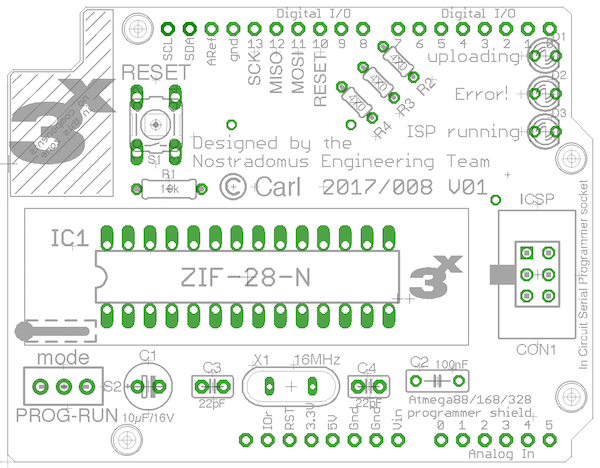

# Atmega88/168/328 ISP programmer shield for Arduino UNO boards

## What

This repo provides you with all necessary info (and files) to build an Arduino shield to program [Atmel](http://www.atmel.com)'s **[atmega88/168/328](http://www.microchip.com/design-centers/8-bit/microchip-avr-mcus)** 𝜇-controllers. For that matter, the underlying Arduino board should be loaded with the ISP-programmer sketch (built-in example).

 

## Why

After having tested one of your new marvelous ideas with an existing eco-system, a lot of airwires and a piece of breadboard, you will probably start designing a state-of-the-art custom pcb to finalize the building of your project. During such a design phase, I however got tired of wiring up the ISP connector over-and-over-again. As (like many people) I was having a spare UNO, which could serve as an ISP programmer, I decided to design a minimalistic shield to fit on top of it.  

## How

The shield has been designed with EAGLE from AutoDesk/CadSoft. This shield [project](eagle-files/) can be opened with the free version [(download here)](http://www.autodesk.com/products/eagle/free-download). Only [through-hole components](BOM.md) have been used in order to make the build also feasible for any junior electronics enthusiast. In the [pdf-folder](pdf-files/) of this repo pdf versions of all important EAGLE views are available, for those not wanting to install EAGLE. Pay attention to print the bottom and top-layer layouts **without re-sizing** (1:1). To have the printed circuit board built by a commercial PCB-shop, the full  [gerber-files](gerber-files/) are also available. When etching the board at home, don't forget to add the vias, or solder pieces of wire from solder to component side.

 

## Technical details

### What’s on the board

The board has been fit with a narrow 28-pin [ZIF](https://en.wikipedia.org/wiki/Zero_insertion_force) socket, which is wired up to be universal for several types of AVR's. On the boarder of the PCB, pin headers with double functionality have been mounted. Pins on the bottom-side to fit on the Arduino board, and feed-through female headers on the top for easy access of all Arduino connections.
The push button, is connected to the reset lines of the AVR in the ZIF socket (and the ISPC on the shield) with a 10kΩ pull-up resistor. When the shield is cut correctly, the reset button for the underlying Arduino UNO should still be accessible. In order to make the Arduino Uno work as an ISP programmer a 10µF capacitor needs to be connected on its reset-line.
Three LED’s are available to visualize the correct functionality of the programming procedure.
An optional AVR ISP connector has been foreseen in order to use the shield as stand-alone with a commercial programmer.

#### BOM - bill of materials

Part | Value | Package | Description  
---- | ----- | ------- | -----------                            
R1     | 10kΩ           | 0207/7       | resistor                                            
R2,3,4 | 470Ω           | 0204/5       | resistor                                            
C1     | 10µF/16V       | E2,5-6E      | polarized capacitor                                 
C2     | 100nF          | C050-025X075 | capacitor                                           
LED1   | 3mm yellow     | 3mm          | LED                              
LED2   | 3mm red        | 3mm          | LED                              
LED3   | 3mm green      | 3mm          | LED
IC1    | 28-pin         | ZIF28-N      | 28-pin narrow ZIF-socket
ICSP1  | 2x3 pin-header | 2x3          | AVR ISP-6 Serial Programming Header (optional)
S1     | momentary      | 6x6x6mm      | momentary tact push button
S2     | toggle         | 9x4mm        | mini toggle switch
CON1   | 6-pin          | SIL06        | long needle female stackable pin header strip
CON2,3 | 8-pin          | SIL08        | long needle female stackable pin header strip
CON4   | 10-pin         | SIL10        | long needle female stackable pin header strip

### How things work

First the the [ISP-programmer sketch](sketches/ArduinoISP.ino) (built-in example) should be loaded to the Arduino UNO board. During that operation, switch S2 should be set to "RUN". Select “Arduino Uno” as target board in the tools-menu. Load the ISP-programmer sketch with the “UPLOAD” button. Once loaded, switch S2 can be set to "PROG" to send a sketch to the atmega 𝜇-controller in the ZIF socket.

  

To load a sketch to your atmega 𝜇-controller in the ZIF socket, make sure that the correct target board is selected in the tools-menu (you might need to download a specific library -> tools-menu, board manager). This time, use the “UPLOAD USING PROGRAMMER” option from the sketch-menu.

 

The 3 LED’s will tell you how things are going :
 - Green  : ISP programmer running
 - Yellow : uploading sketch
 - Red    : Error!  

### Proof of concept

So far, I have tested the shield with the below list of 𝜇-controllers :
- atmega168
- atmega328

 Programming should also work out well for other pin-compatible µ-controllers, such as :
 - atmega88

 ## Contributors

 If you are having any good suggestions, just drop me a line [:email:](http://nostradomus.ddns.net/contactform.html).
 If feasible, I'll be happy to implement proposed improvements.
 And if you are having lots of time, I'll be happy to share the work with you ;-).

 When you create your own version, don't forget to send us some nice pictures of your construction. We'll be happy to publish them in the :confetti_ball:Hall of Fame:confetti_ball:.

 ## :globe_with_meridians: License

 At this moment, there is no specific license attached to this project yet.

 So, today, if you like it, have fun with it (at your own risk of course :-D), and especially, be creative.

 Oh, and when using anything from this repository, it is highly appreciated if you mention its origin.

 If you would like to use any of this work (or the whole project) for commercial use, first [contact us :email:](http://nostradomus.ddns.net/contactform.html), so we can add the appropriate license, which best fits your business.
